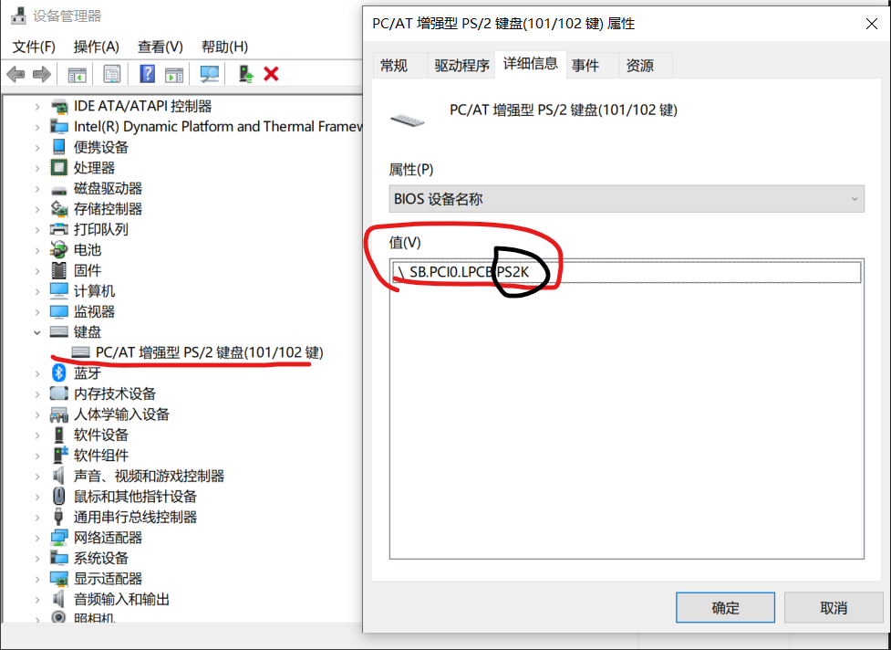
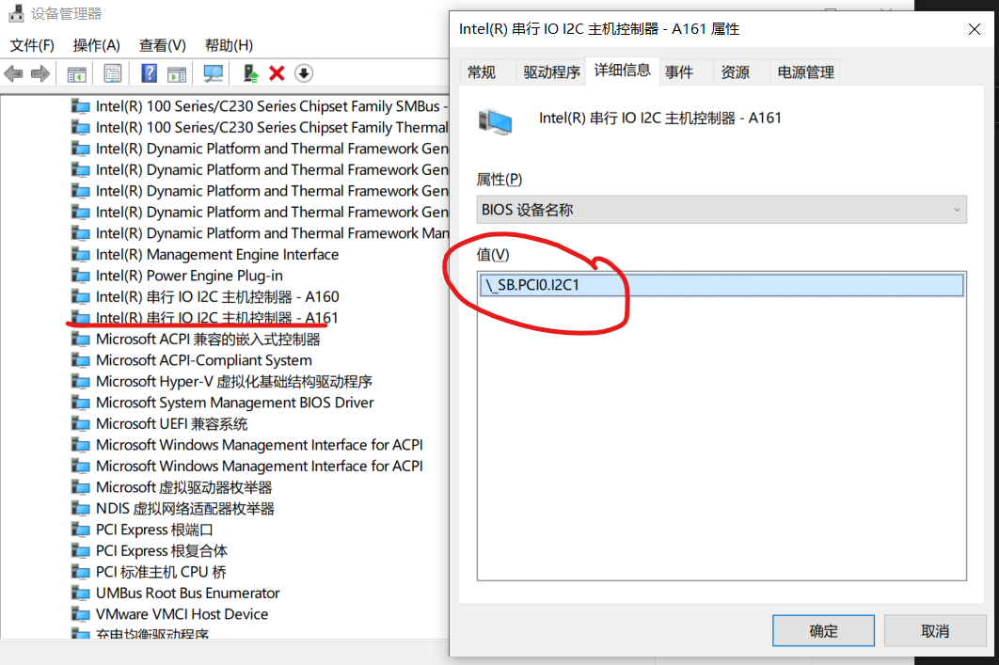
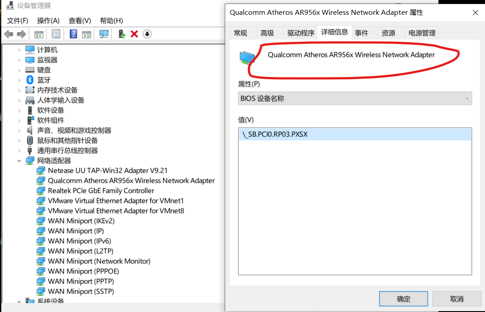
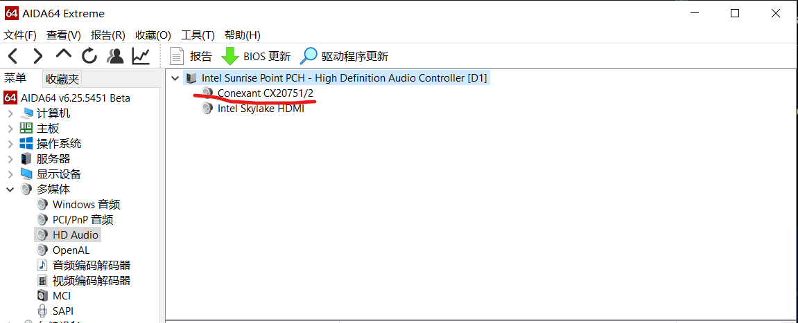

Mac OS 10.15.6 hackintosh(黑苹果) OpenCore 0.6.0(DEBUG版) 完美驱动备份

请优先尝试[release版](https://github.com/threewater2/hackintosh/releases)

[安装教程](https://github.com/threewater2/hackintosh/install-guide.md)

Version: 1.0

## 哪些可用(works)?

| 名称     | 是否可用 |
| -------- | -------- |
| 键盘     | OK       |
| 声音     | OK       |
| 麦克风   | OK       |
| 键盘背光 | OK       |
| 触控板   | OK       |
| USB接口  | OK       |
| 电量显示 | OK       |
| WIFI     | OK       |
| 有线网卡 | OK       |

## 哪些不可用(not works)?

| 名称    | 是否可用 |
| ------- | -------- |
| 蓝牙    | NO       |
| GTX960M | NO       |

## 确认的你的配置(verify config)

以下关键配置不同都可能导致某些功能无法使用.

| 类型     | 名称              |
| -------- | ----------------- |
| 主板     | GL552VW           |
| CPU      | i5-6300HQ         |
| 键盘     | PS2键盘           |
| WIFI     | AR9565(x)         |
| 触控板   | ELAN类型(I2C设备) |
| 声卡     | CX20751/2         |
| BIOS版本 | 304               |

​	

## BIOS设置

任何一项BIOS设置的不同都会导致为DSDT打的补丁无法使用,严重时可能导致无法启动.

| 名称                             | 配置       |
| -------------------------------- | ---------- |
| Internal Pointing Device         | Enabled    |
| Wake On Lid Open                 | Enabled    |
| Intel Virtuallization Technology | Enabled    |
| Intel AES-NI                     | Disabled   |
| VT-d                             | Disabled   |
| I/O Interface Security           | All/Unlock |
| USB Interface Security           | All/Unlock |
| Secure Boot                      | Disabled   |
| Secure Boot Control              | Disabled   |
| Launch CSM                       | Disabled   |
| Lanuch PxE OpROM plicy           | Enabled    |
| Legacy USB Support               | Enabled    |
| USB Mass Storage Driver Support  | Enabled    |
| NetWork Stack                    | Disabled   |
| SATA Mode Selection              | AHCI       |
| DVMT Pre-Allocated               | 256M       |
| SMART Self Test                  | Enabled    |

## 安装前工具(Pre Install)

| 名称       | 描述                     |
| ---------- | ------------------------ |
| gibMacOS   | 用来下载MacOS镜像        |
| ProperTree | 用来编辑OpenCore配置文件 |

## 安装后工具(Post Install)

| kext utility | 用来重建Kext缓存 |
| ------------ | ---------------- |
| MacsiL       | 用来打DSDT补丁   |

## 教程汇总(Tutorials)

[OpenCore权威教程(en)](https://dortania.github.io/OpenCore-Install-Guide/)

[编译自己的DSDT和打补丁(en)](https://www.tonymacx86.com/threads/guide-patching-laptop-dsdt-ssdts.152573/)

[驱动AR9565(x)](https://www.longzc.cn/index.php/archives/168)  安装成功后走这一步.

## 部分kext说明

`ACPIBatteryManager.kext` 解决笔记本电源管理,以及电量不显示问题

`CtlnaAHCIPort.kext` 解决SATA硬盘不兼容问题

`AsusSMC.kext` 是VirtualSMC.kext的插件,解决华硕键盘灯,Fn键问题

`AppleALC.kext` 解决声卡问题

`VoodooPS2Controller.kext` PS2键盘驱动

`VoodooI2C.kext` I2C总线上的触控板驱动

`VoodooI2CELAN.kext` 是VoodooI2C.kext的插件,ELAN类型的触控板驱动

## 其它(Other)

 把`CFGunlock.efi` 放入 `EFI\OC\Tools\` 下 [解锁CFG(unlock CFG)](https://www.insanelymac.com/forum/topic/344035-cfglock-unlock-msr-0xe2/)

`EFI\OC\Tools\acpidump.efi` 用来提取DSDT文件

`EFI\OC\Tools\VerifyMsrE2.efi` 用来验证CFG是否解锁

`backup\INT3443.txt` I2C1触摸板补丁

 ###  确保BIOS名称一样(ensure BIOS name)

如果BIOS名称不一样也可能导致某些功能无法使用.

 如果Github图片不显示或者链接打不开,请自备梯子,或者下载到本地

1. 键盘

2. 触控板

3. 无线网卡

4. 声卡

