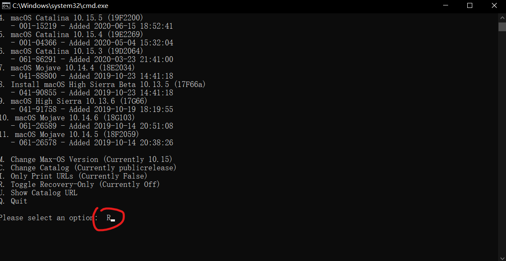
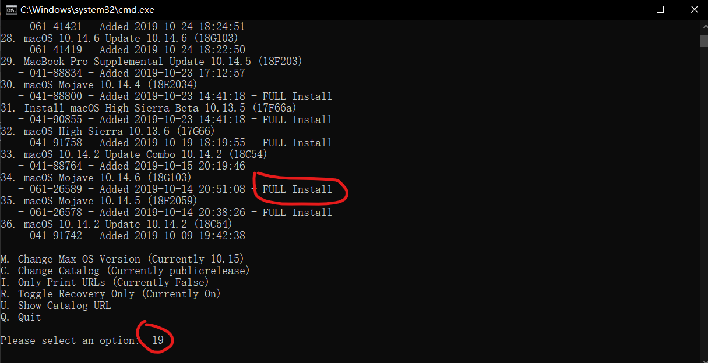
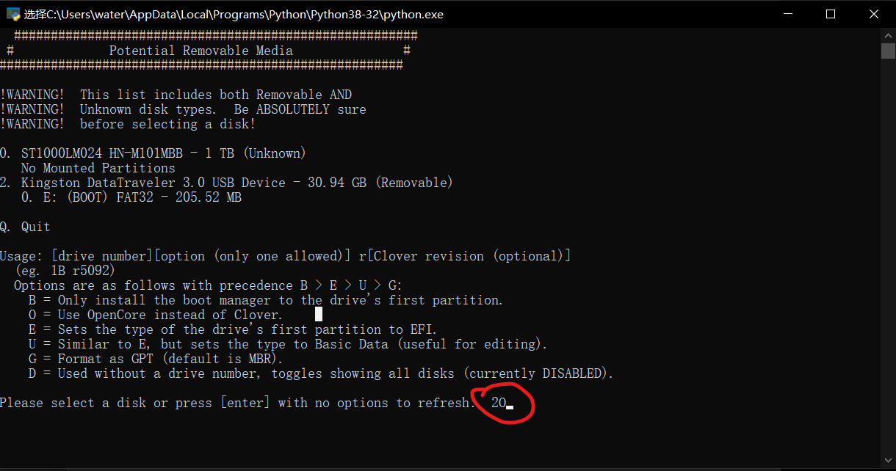
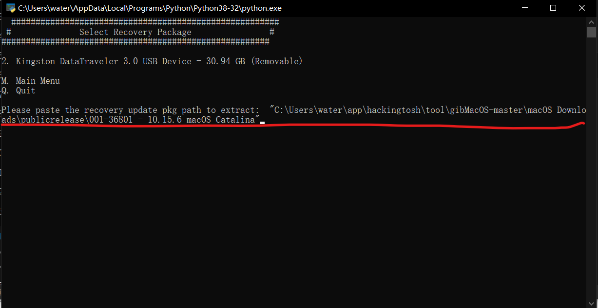

安装教程

## 使用命令行安装(推荐)

1. 下载工具

https://github.com/corpnewt/gibMacOS

2. 下载MacOS

   运行`gibMacOS.bat`

   设置只下载恢复模式镜像

   

   

   选择你要下载的macOs版本(认准full install标志)

   

   

3. 写入mac镜像

   运行`MakeInstall.bat`

   

   2表示你的U盘,O表示OpenCore(默认是Clover)

   

   

   

   路径为你上面下载的镜像位置(记得加双引号)

   
   
   

### 注意事项

安装过程中会从GitHub下载Opencore最新的release,由于Github访问较慢,请自备梯子

其实如果提示正在下载OpenCore表明镜像已经制作完毕,直接把整个EFI拷贝进BOOT分区就行(理论上)

如果出现USB找不到的情况,请重新拔插USB.

安装盘制作完成.

## 方式二        使用黑果小兵的镜像